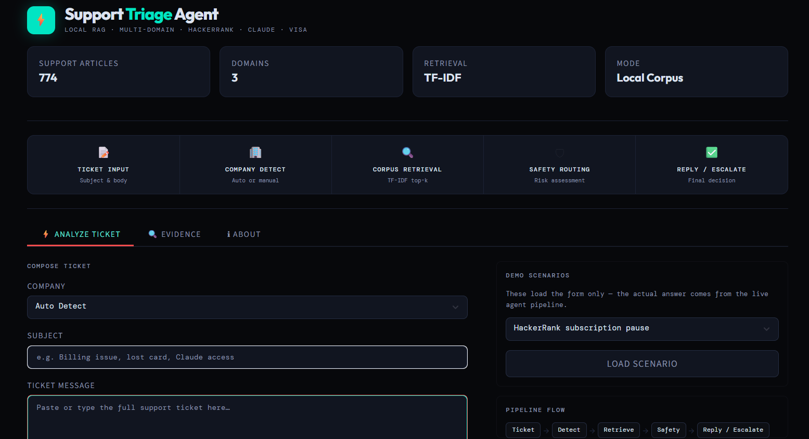
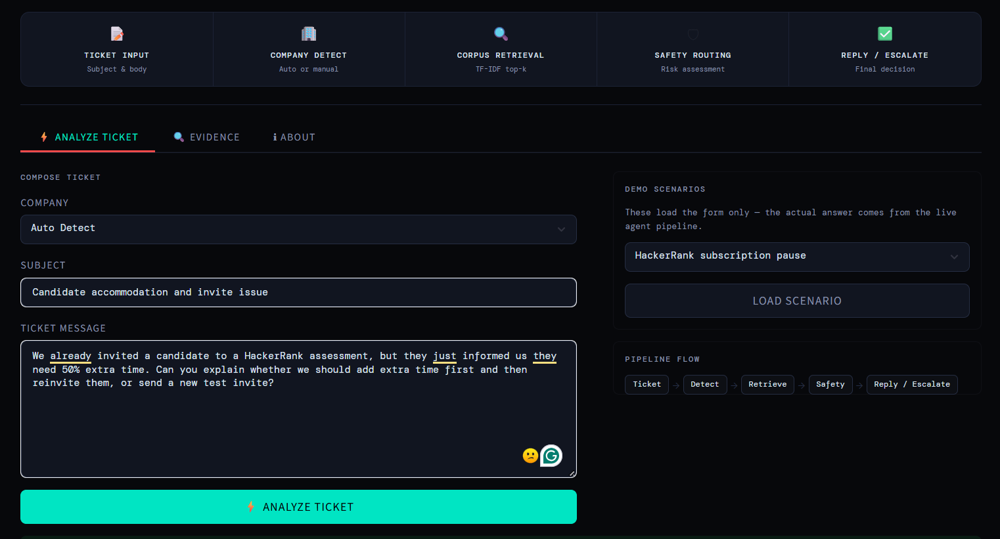
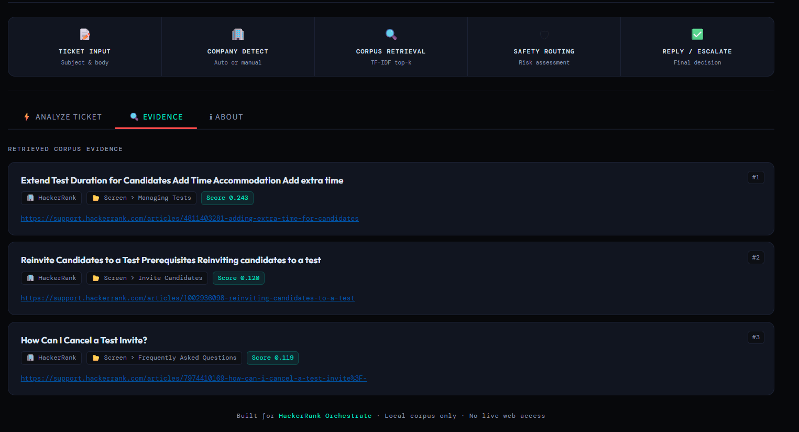
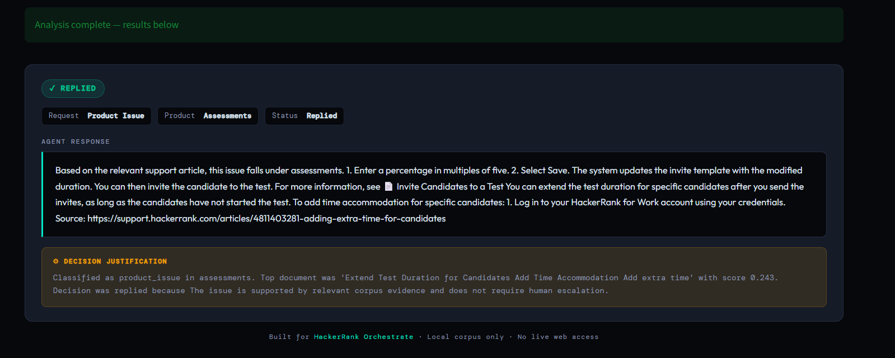

<div align="center">


<br /><br />

# ⚡ Support Triage Agent

### A local corpus-based support triage system built for the HackerRank Orchestrate May 2026 Hackathon.

*Handling support tickets across HackerRank, Claude, and Visa — not by answering everything, but by knowing when not to.*

<br />



</div>

---

## 📌 Table of Contents

- [Overview](#-overview)
- [Core Idea](#-core-idea)
- [System Pipeline](#-system-pipeline)
- [Demo Interface](#-demo-interface)
- [Key Features](#-key-features)
- [Project Structure](#-project-structure)
- [How To Run](#-how-to-run)
- [Final Results](#-final-results)
- [Example Behaviors](#-example-behaviors)
- [Design Decisions](#-design-decisions)
- [AI Assistance](#-ai-assistance)
- [Key Learning](#-key-learning)
- [Links](#-links)

---

## 🧠 Overview

This project is a **terminal-based support triage system** with an additional **Streamlit demo interface** for presentation.

The agent reads a provided local support corpus, retrieves relevant documentation, classifies the ticket, identifies the product area, checks risk level, and produces a structured triage decision.

It handles support tickets across **three different ecosystems**:

| Domain | Coverage |
|---|---|
| 🟢 **HackerRank** | Assessments, subscriptions, candidates, billing |
| 🔵 **Claude** | Workspace access, crawler settings, privacy |
| 🟡 **Visa** | Lost cards, refunds, disputes, fraud |

The final output is a **CSV file** with these fields:

```
status | product_area | response | justification | request_type
```

---

## 💡 Core Idea

> A simple chatbot tries to answer everything.
> **This system tries to triage.**

Most support automation makes the mistake of attempting to answer every ticket. This system does the opposite — it only replies when the provided corpus contains **sufficient grounded evidence**. When it cannot be confident, it escalates to a human.

**It replies when:**
- The corpus has a directly relevant support article
- The request is public guidance with no account-level action required
- Evidence score is above the safety threshold

**It escalates when:**
- Evidence is weak or unrelated
- The ticket requires account access changes
- The issue involves payments, refunds, or disputes
- Security risk, identity theft, or fraud is mentioned
- An admin or permission change is requested
- A score correction or override is asked for

---

## ⚙️ System Pipeline

```
Support Ticket
    → Company Detection        (auto-inferred or manually selected)
    → Request Type Classification
    → Product Area Detection
    → Corpus Retrieval          (TF-IDF, top-k)
    → Safety Routing            (risk check)
    → Reply or Escalate
    → CSV Output
```

<div align="center">

| Step | Function | Detail |
|:---:|---|---|
| 📝 | **Ticket Input** | Subject + message body |
| 🏢 | **Company Detect** | Auto-infer or manual override |
| 🔍 | **Corpus Retrieval** | TF-IDF similarity, top-k articles |
| 🛡 | **Safety Routing** | Risk assessment against escalation rules |
| ✅ | **Reply / Escalate** | Final structured decision |

</div>

---

## 🖥 Demo Interface

The Streamlit demo provides an interactive view of the full pipeline in real time.

### Home & Ticket Input

The main screen shows the system stats, the full pipeline flow, and the ticket composition form. You can either type a custom ticket or load one of the built-in demo scenarios.



---

### Retrieved Evidence

After analyzing a ticket, the **Evidence** tab shows the top-k corpus documents that were retrieved. Each card shows the article title, company, breadcrumb path, similarity score, and a direct link to the source URL.



---

### Agent Result

The **result card** shows the triage decision — status pill, request type, product area, grounded agent response, and the decision justification explaining exactly why the system replied or escalated.



---

## 🔑 Key Features

### 📦 Local Corpus Only

The agent does **not** use live web access. It only uses the provided Markdown support corpus.

This keeps the system:
- **Grounded** — answers are traceable to a specific article
- **Reproducible** — same input always produces the same output
- **Explainable** — every decision has a documented justification
- **Safe** — no hallucinated or unsupported claims

---

### 🌐 Multi-Domain Support

The same pipeline works across three distinct support domains with different risk profiles:

- **HackerRank** — assessments, scores, subscriptions, candidates
- **Claude** — workspace access, crawlers, privacy, API
- **Visa** — payments, disputes, lost cards, fraud

---

### 🔍 Retrieval-Based Evidence

The retrieval index combines multiple signals for higher precision:

- Article body text
- Article titles
- Breadcrumb paths
- Direct token overlap

Support article **titles and breadcrumbs** carry strong product area signals that plain body-text retrieval would miss.

---

### 🛡 Safety-First Routing

The agent escalates tickets when they involve:

| Category | Examples |
|---|---|
| Account access | Restoring seats, unlocking accounts |
| Score changes | Requesting score corrections |
| Payments & refunds | Refund approval, chargeback initiation |
| Security | Identity theft, fraud reports |
| Admin actions | Permission changes, admin seat changes |
| Weak evidence | Low retrieval scores, off-topic articles |
| Unsupported domains | Topics outside the provided corpus |

---

### 📋 Grounded Responses

When the system **does** reply, the response is generated directly from the retrieved support article. A justification is also produced, explaining the classification, top document, score, and decision rationale.

---

### 🏷 Request Types & Status Values

**Request Types:**

| Type | Description |
|---|---|
| `product_issue` | Feature or usage problem |
| `bug` | System or platform malfunction |
| `feature_request` | Request for new functionality |
| `invalid` | Out of scope or irrelevant |

**Status Values:**

| Status | Meaning |
|---|---|
| `replied` | Evidence sufficient, agent answered |
| `escalated` | Risk detected or evidence too weak |

---

## 📁 Project Structure

```
code/
├── agent.py              # Full ticket processing pipeline
├── classifier.py         # Request type, company, product area detection
├── config.py             # Paths and configuration constants
├── corpus_loader.py      # Markdown article loader and parser
├── logger.py             # Run logging utility
├── main.py               # Entry point — sample validation & CSV output
├── models.py             # Data models and types
├── response_builder.py   # Grounded response generation
├── retriever.py          # TF-IDF retrieval index
├── safety.py             # Escalation rule engine
├── streamlit_app.py      # Interactive Streamlit demo
└── requirements.txt

data/
├── claude/               # Claude support corpus (Markdown)
├── hackerrank/           # HackerRank support corpus (Markdown)
└── visa/                 # Visa support corpus (Markdown)

support_tickets/
├── sample_support_tickets.csv   # Labelled sample tickets for validation
├── support_tickets.csv          # Final ticket batch
└── output.csv                   # Generated triage output

assets/
├── demo_home.png
├── demo_input.png
├── demo_evidence.png
└── demo_result.png
```

---

## 🚀 How To Run

### 1. Install dependencies

```bash
pip install -r code/requirements.txt
```

### 2. Run sample validation

Reads the sample support tickets and compares predicted labels with expected labels.

```bash
python code/main.py sample
```

### 3. Generate final output

Reads the final support tickets and writes results to `support_tickets/output.csv`.

```bash
python code/main.py final
```

### 4. Run the Streamlit demo

```bash
python -m streamlit run code/streamlit_app.py
```

---

## 📊 Final Results

The final run processed **29 support tickets**.

<div align="center">

| Decision | Count |
|---|:---:|
| ⚠️ Escalated | **21** |
| ✅ Replied | **8** |

| Request Type | Count |
|---|:---:|
| `product_issue` | **19** |
| `bug` | **9** |
| `invalid` | **1** |

</div>

The high escalation rate reflects the system's deliberate safety-first design. When evidence is uncertain or the ticket requires account-level action, the correct answer is to escalate — not to guess.

---

## 🧪 Example Behaviors

### ✅ Public guidance ticket — *Replied*

> *"Hi, please pause our subscription. We have stopped all hiring efforts for now."*

**Result:** `status: replied`

**Reason:** The corpus contains a direct article covering subscription pause procedures. No account action is required to provide this guidance.

---

### ⚠️ Score change request — *Escalated*

> *"My test score is wrong. Please review my answers and increase my score."*

**Result:** `status: escalated`

**Reason:** Score corrections are account-specific and sensitive. The system should not make or promise changes to assessment results.

---

### ⚠️ Visa refund demand — *Escalated*

> *"I bought something online with my Visa card, but the merchant sent the wrong product. Please make Visa refund me today."*

**Result:** `status: escalated`

**Reason:** Refund approval and merchant disputes require human review. The corpus can provide guidance but cannot initiate financial actions.

---

### ✅ Claude crawler blocking — *Replied*

> *"I want Claude to stop crawling my website. What should I do?"*

**Result:** `status: replied`

**Reason:** The corpus contains public guidance about blocking Anthropic's web crawlers via `robots.txt`. This is general technical guidance with no account action required.

---

## 🧩 Design Decisions

### Why local corpus only?

The challenge required the agent to use the provided corpus. This also improves **reproducibility** — the same input always produces the same output, making the system auditable and predictable.

### Why TF-IDF?

TF-IDF was chosen because the corpus is fixed, local, and documentation-heavy. It is:

- **Fast** — no model inference overhead
- **Deterministic** — same query always returns the same results
- **Explainable** — term overlap is interpretable
- **Easy to debug** — scores are transparent

### Why not answer everything?

Support automation should not guess. If the evidence is weak or the ticket requires account-level action, the safer and more trustworthy decision is escalation. Confidence requires evidence.

---

## 🤖 AI Assistance

I used **ChatGPT** as a design and coding assistant during development. It helped with planning, debugging, code structure, and interview preparation.

I reviewed all outputs, tested the code locally, challenged overly static logic, and refined the system toward a more general retrieval and safety-based design.

---

## 🎓 Key Learning

> A good support agent is not the one that answers every ticket.
> **A good support agent knows the limits of its evidence.**

This project helped me understand how **retrieval**, **classification**, **safety routing**, and **grounded response generation** work together in a practical AI agent workflow. The most valuable insight was building an explicit escalation layer — not as a fallback, but as an intentional first-class part of the pipeline.


<div align="center">

**Built for [HackerRank Orchestrate](https://www.hackerrank.com) May 2026 Hackathon**

*Local corpus only · No live web access · Safety-first design*

</div>
